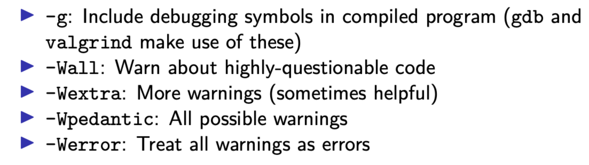
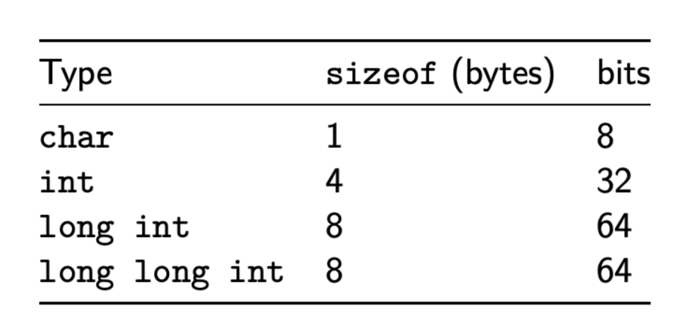
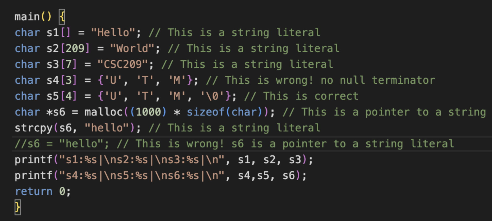
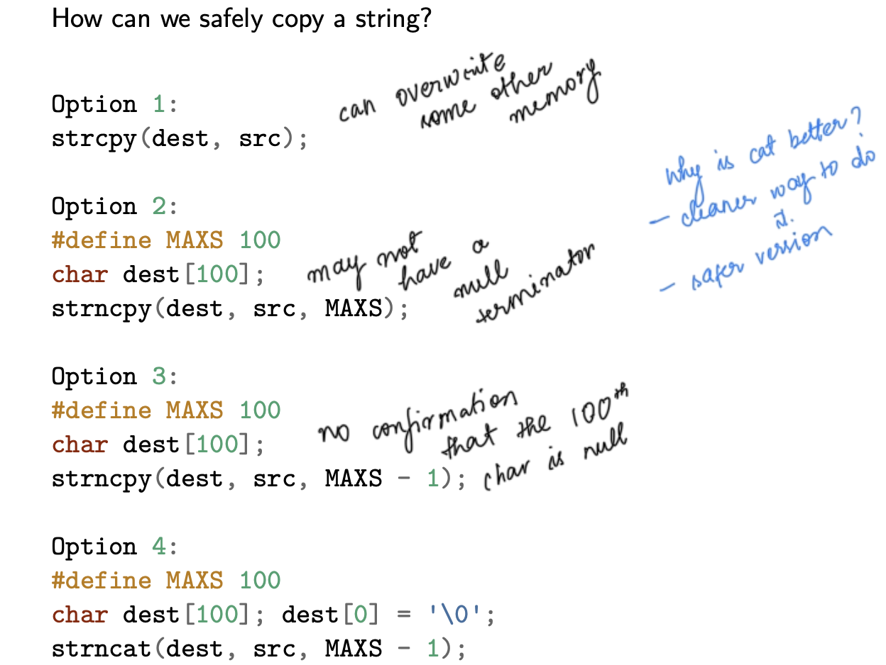
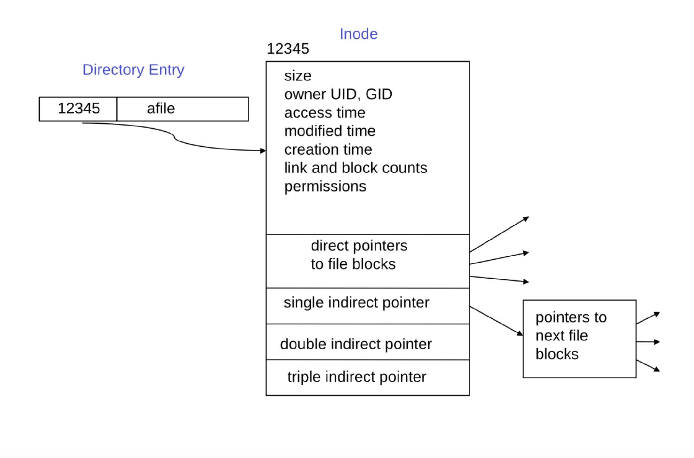
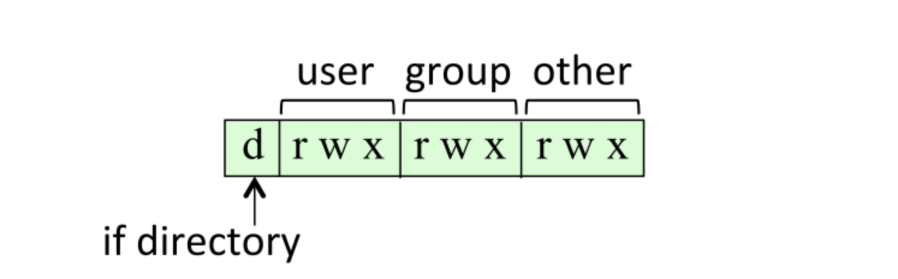
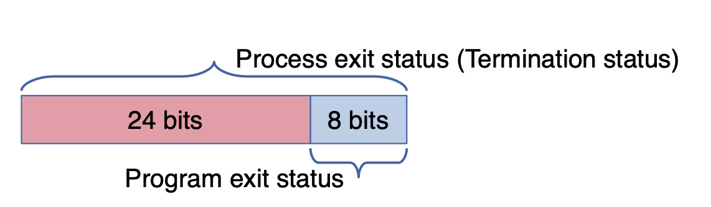
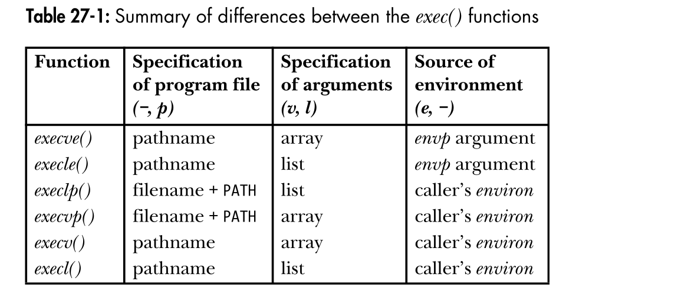
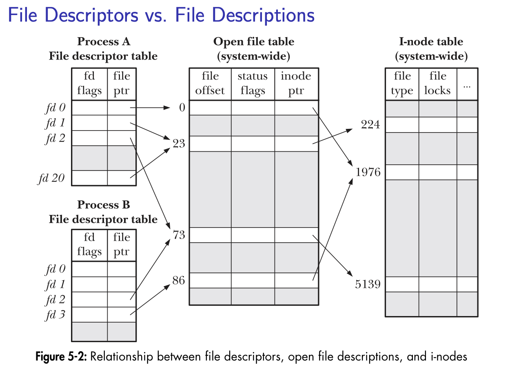

Over this week, I have been reviewing into low-level programming to get ready for my Operating Systems course. My review included C, Unix systems, memory, processes, and all the details that usually stay hidden behind higher-level abstractions.

These notes started as class notes and scratch explanations to myself—things I wrote down to slow my thinking and make sure I truly understood what was happening underneath the code I was writing. Over time, they grew into something more structured: a reference I kept returning to when debugging, reasoning about memory, or trying to explain systems behavior to myself.

I am sharing them here mostly for my future self, but also for anyone else learning systems programming who wants a grounded, end-to-end view of how programs interact with the operating system. This isn’t meant to be exhaustive or perfectly polished, it’s a living document that reflects how my understanding is evolving as I learn.

If you are reading this while learning C or systems programming, I hope these notes make the learning curve feel a little less steep. Low-level concepts can feel overwhelming at first, but they are also deeply empowering once they start to click. I will keep updating and refining these as I go, both as a record of what I have learned and as a reminder of how much clarity comes from understanding things at their foundation. So, without further adieu! 💪

## Development Environment

### Man Pages
- **Section 1**: General shell commands (how to use a command)
- **Section 2**: System calls
- **Section 3**: Library functions
- **Section 7**: Miscellaneous information

```bash
man 2 open          # System call
man 3 printf        # Library function
```

### Compilation
```bash
gcc -g program.c -o program              # Debug symbols
gcc -Wall -Wextra program.c              # Warnings
gcc -fsanitize=address program.c         # Memory errors
gcc -fsanitize=undefined program.c       # UB detection
```



**Compilation Pipeline**: Preprocessing → Compilation → Assembly → Linking

### Debugging Tools
- **gdb**: Breakpoints, stepping, variable inspection
  - Compile with `-g`, use `break`, `next`, `step`, `print`, `display`
- **valgrind**: Memory leaks, invalid access (`--leak-check=full`)
- **strace**: System call tracing
- **ltrace**: Library call tracing

---

## Memory Management

### Memory Layout
```
High Addresses
├─────────────────┤
│   Kernel Space  │ (inaccessible)
├─────────────────┤
│      Stack      │ ← grows down (local vars, function calls)
├─────────────────┤
│                 │
├─────────────────┤
│      Heap       │ ← grows up (malloc/free)
├─────────────────┤
│  BSS (Uninit)   │ (global/static, zero-initialized)
├─────────────────┤
│  Data (Init)    │ (global/static, initialized)
├─────────────────┤
│      Text       │ (executable code, read-only)
└─────────────────┘
Low Addresses
```

### Stack vs Heap vs Static
- **Stack**: Automatic, fast, limited size (~1-8 MB), LIFO
- **Heap**: Manual (malloc/free), slower, large, persistent across functions
- **Static/Global**: Entire program lifetime, initialized once

### Dynamic Allocation
```c
int *p = malloc(sizeof(int) * n);    // Uninitialized
int *p = calloc(n, sizeof(int));     // Zero-initialized
int *p = realloc(old_ptr, new_size); // Resize
free(p);                             // Deallocate
```
In higher programming languages, garbage collector frees up memory when the object is no longer in use. But in C, the garbage collector does not exist.

Size of C primitives:




**Critical Rules**:
- Always check for NULL after allocation
- Free exactly once per allocation
- Do not use after free
- Do not free stack memory
- Match malloc with free

**Common Errors**:
- Memory leaks (forgot to free)
- Double free (freed twice)
- Use after free (accessing freed memory)
- Buffer overflow (writing beyond bounds)

### Undefined Behavior
C makes no guarantees when:
- Array out-of-bounds access
- Null/uninitialized pointer dereference
- Use after free
- Signed integer overflow
- Unsequenced modifications (`i = i++`)

**Detection**: Use `-fsanitize=address`, `-fsanitize=undefined`, valgrind

---

## Command Line Arguments
```c
int main(int argc, char *argv[]) {
    // argc = number of args (including program name)
    // argv[0] = program name
    // argv[1]...argv[argc-1] = arguments
    // argv[argc] = NULL
    
    if (argc < 2) {
        fprintf(stderr, "Usage: %s <file>\n", argv[0]);
        exit(1);
    }
    
    // Parse integer
    long num = strtol(argv[1], &endptr, 10);
}
```
## Macros
```c
#define MAX_SIZE 1000
#define MAX(a,b) ((a) > (b) ? (a) : (b))

// Conditional
#ifdef DEBUG
    printf("debug\n");
#endif

#if defined(LINUX)
    // Linux code
#elif defined(MACOS)
    // macOS code
#endif
```
---
## Strings and Memory Safety
- Contiguous memory spaces where the null character (\0) indicates the termination of the string.
- `string.h` is the standard string library that offers string manipulation.



### Safe String Functions
```c
// NEVER use: gets(), strcpy(), strcat(), sprintf()

fgets(buf, sizeof(buf), stdin);          // Safe input
strncpy(dest, src, sizeof(dest) - 1);    // Safe copy
dest[sizeof(dest) - 1] = '\0';           // Ensure null-term
strncat(dest, src, sizeof(dest) - strlen(dest) - 1);
snprintf(buf, sizeof(buf), "fmt %d", x); // Safe format
```

### String Basics
- Strings are char arrays terminated by `\0`
- `strlen(s)` counts characters (NOT including `\0`)
- Always allocate size + 1 for null terminator
- `fgets()` includes newline if present

---

### Structures
```c
struct person {
    char name[50];
    int age;
};

struct person p = {"Alice", 30};
p.age = 31;

struct person *pp = &p;
pp->age = 32;  // Arrow notation for pointers

// Returning from functions
struct person create() {
    struct person p = {"Bob", 25};
    return p;  // Copies entire structure
}

// Dynamic allocation
struct person *p = malloc(sizeof(struct person));
free(p);
```

**Padding**: Structures aligned for efficiency. Order members by size to minimize padding.


## Pointers and Arrays
**POINTER**: A variable that contains the memory address of another variable.

### Basics
```c
int x = 10;
int *px = &x;        // & = "address of"
*px = 20;            // * = "dereference"
```

### Pass by Value vs Reference
- Pass by Value: In C, arguments are passed by value. This means that when you call increment_int(x), a copy of the value of x (which is 10) is passed to the function. Any modifications to the parameter inside the increment_int function only affect this copy, not the original x in the calling function.

- Pass by Reference (using Pointers): When you call increment2_int(&x), you are passing the address of x to the function. The & operator obtains the address of x in memory. The function increment2_int declares its parameter as a pointer (e.g., int *px). Inside increment2_int, the pointer px now "points to" the memory location of x.
  - By using the indirection operator * on px (e.g., *px = *px + 1;), the function can directly access and modify the value stored at that memory location. Therefore, the original x is modified. *px is an lvalue, meaning it can be used on the left side of an assignment.
  - It's important to initialize pointers before using them. Dereferencing an uninitialized pointer leads to undefined behavior

Thus,
- To modify original: pass address (`&var`) and dereference (`*ptr`)
- Arrays decay to pointers when passed to functions

### Const Correctness
```c
const int *p;        // Cannot modify value
int *const p;        // Cannot change address
const int *const p;  // Neither
```

### Arrays and Pointers
- `arr[i]` is syntactic sugar for `*(arr + i)`
- `sizeof(arr)` = full array size (only in scope where declared)
- `sizeof(ptr)` = pointer size (8 bytes on 64-bit)
- Pointer arithmetic scales by `sizeof(*ptr)`

---

## File Systems

### Directories
- Directory
  - a file that contains directory entries
  - special file mapping filenames to inode numbers
- Navigation:
  - Relative Paths:**
```bash
./file              # Current directory
../file             # Parent directory
../../file          # Grandparent directory
pwd                 # Print working directory
cd ~                # Home directory (~/ expands to home)
cd /                # Root directory
cd -                # Previous directory
```

- **Inode**:
  - Data structure containing information about a file – access permissions, size, timestamps, disk location, link count, etc.
  - Does NOT contain filename (stored in directory entry)
  
  


```bash
ls -i               # Show inode numbers
stat filename       # Detailed inode info
```

### File Permissions



- The three categories– the files user, the owning group, and all other users

**Bits**: r=4, w=2, x=1

For directories:
- r = list contents (ls)
- w = create/delete files
- x = enter directory (cd)

- chmod to change permissions
  - ```ls -l```, ```ls -ali``` (with inode)
  - ```chmod hex_number_permission file.txt```
    ```bash
    chmod 755 file      # rwxr-xr-x
    chmod u+x file      # Add execute for user
    ```

### Standard I/O Streams
```
stdin   (fd 0)  - keyboard
stdout  (fd 1)  - terminal
stderr  (fd 2)  - terminal
```

### Common File Flags
```
O_RDONLY   - Read only
O_WRONLY   - Write only
O_RDWR     - Read and write
O_CREAT    - Create if doesn't exist
O_TRUNC    - Truncate to 0
O_APPEND   - Append mode
O_EXCL     - Fail if exists (with O_CREAT)
```

Using a file:
- Opening and Closing:
```c
FILE *fp = fopen('data.txt', "r");
if (fp == NULL){
  printf("Error\n");
  return -1;
}
fclose(fp);
```
- Reading
  - Char 
  ```c
  buffer[100];
  fgets(buffer, 100, fp);
  ```
  - fgets stops when it reaches a newline, reads size-1, reaches EOF 
     - `fgets()`:
     ```c
     char *fgets(char *s, int size, FILE *stream);
     ```
		fgets stops reading at a newline or end of file, storing what it read in s. If it reads a newline, that newline is stored. fgets reads at most size - 1 bytes and always null-terminates s.


**Redirection**:
```bash
cmd > file          # Redirect stdout (overwrite)
cmd >> file         # Append stdout
cmd 2> file         # Redirect stderr
cmd 2>&1            # Redirect stderr to stdout
cmd1 | cmd2         # Pipe stdout to stdin
```

### Links
- **Hard link**: Multiple directory entries → same inode (share data)
  - `ln original link`
  - Cannot cross filesystems, cannot link directories
- **Symbolic link**: Separate file containing path to target
  - `ln -s target symlink`
  - Can cross filesystems, can link directories, breaks if target deleted

---

## Processes

### Process Basics
- Process = instance of executing program
  - Executing multiple instance of the same program launches multiple processes (many notepad windows)
  - A single instance can also launch multiple instances (tabs in chrome)
 
- Each has unique PID, own memory space, own FD table
- First process (PID 1): init/launchd (macOS) and systemd (Ubuntu)

```bash
ps aux              # View processes
pstree              # Tree view (prints all currently running processes)
```

### fork()
Creates child process by duplicating parent.

When can fork() fail?
- Total number of process exceeded by user
- Insufficient system memory to create a new process
- Kernel constrain on the number of processes
- Returns -1 on failure

**Returns**:
- Parent: child's PID
- Child: 0
- Error: -1

A process exit status is returned back to the parent process via wait/waitpid. If the program exits it contains its low order 8 bits.



Inside main, return and exit almost same, the return value of main is the exit status passed to exit()
- exit() performs some cleanup, flush stdio streams and calls _exit
- _exit() sets the process exit status, or termination status and terminates the process.
- Outside main, use exit() to terminate processes

```c
pid_t pid = fork();
if (pid < 0) {
    perror("fork");
    exit(1);
} else if (pid == 0) {
    // Child process
    printf("Child: PID=%d PPID=%d\n", getpid(), getppid());
    exit(0);
} else {
    // Parent process
    printf("Parent: Child PID=%d\n", pid);
    wait(NULL);
}
```

**After fork()**: Child gets copy of parent's data, stack, heap, FD table. File offsets are shared.

**Fork Patterns**:
```c
// Multiple children
for (int i = 0; i < n; i++) {
    if (fork() == 0) {
        // Child i work
        exit(i);
    }
}
for (int i = 0; i < n; i++) wait(NULL);

// Chain (each creates one child)
for (int i = 0; i < n; i++) {
    pid_t pid = fork();
    if (pid == 0) continue;  // Child continues loop
    else { wait(NULL); break; }  // Parent waits and exits loop
}
```

### Exit and Wait
```c
exit(status);       // Cleanup (flush buffers) then terminate
_exit(status);      // Immediate termination

// Wait for child
int status;
pid_t pid = wait(&status);           // Any child
pid_t pid = waitpid(pid, &status, 0); // Specific child

// Extract exit status
if (WIFEXITED(status)) {
    int code = WEXITSTATUS(status);  // 0-255
}
if (WIFSIGNALED(status)) {
    int sig = WTERMSIG(status);
}
```

**Wait Status Macros**
```
WIFEXITED(status)    - Normal exit?
WEXITSTATUS(status)  - Exit code
WIFSIGNALED(status)  - Killed by signal?
WTERMSIG(status)     - Signal number
```

### Zombie and Orphan Processes
- **Zombie**: Child exited but parent hasn't called wait() (shows as `<defunct>`)
- **Orphan**: Parent died before child; init adopts and reaps

### exec() Family
Replaces current process image with new program.




```c
execl("/bin/ls", "ls", "-l", NULL);              // List args
execlp("ls", "ls", "-l", NULL);                  // Search PATH
execv("/bin/ls", argv);                          // Array args
execvp("ls", argv);                              // Array + PATH
execve(path, argv, envp);                        // Array + env
```

**Properties**:
- Never returns on success (only on failure: -1)
- PID stays same
- File descriptors remain open (unless FD_CLOEXEC)
- FILE* streams lost

**Shell Pattern (fork + exec + wait)**:
```c
pid_t pid = fork();
if (pid == 0) {
    execvp(argv[0], argv);  // Child executes command
    perror("exec");
    exit(1);
} else {
    wait(NULL);  // Parent waits
}
```

---

## File Descriptors and I/O

### File Descriptor Levels
- **Low-level** (system calls): Unbuffered, FD (int), `open/read/write/close`
- **High-level** (stdio): Buffered, FILE*, `fopen/fread/fwrite/fclose`

### Low-Level I/O
```c
int fd = open("file.txt", O_RDONLY);
int fd = open("file.txt", O_WRONLY | O_CREAT | O_TRUNC, 0644);

ssize_t n = read(fd, buf, count);   // Returns bytes read, 0=EOF, -1=error
ssize_t n = write(fd, buf, count);  // Returns bytes written, -1=error
close(fd);

// File positioning
lseek(fd, 0, SEEK_SET);     // Beginning
lseek(fd, 0, SEEK_END);     // End
lseek(fd, offset, SEEK_CUR); // Relative
```

**Important**: read/write may be partial. Loop until complete:
```c
while (total < count) {
    ssize_t n = read(fd, buf + total, count - total);
    if (n <= 0) break;
    total += n;
}
```

### File I/O (stdio)
```c
FILE *fp = fopen("file.txt", "r");  // "r", "w", "a", "r+", "w+", "a+"
if (fp == NULL) { perror("fopen"); exit(1); }

// Reading
fgets(line, sizeof(line), fp);
fscanf(fp, "%d", &num);
fread(arr, sizeof(int), 10, fp);

// Writing
fprintf(fp, "format %d\n", x);
fputs("line\n", fp);
fwrite(arr, sizeof(int), 10, fp);

// Positioning
fseek(fp, offset, SEEK_SET/CUR/END);
ftell(fp);        // Current position
rewind(fp);       // Back to start

fflush(fp);       // Force write buffered data
fclose(fp);       // Close and flush
```

### dup() and dup2()
Duplicate file descriptors.

```c
int fd2 = dup(fd);              // Lowest available FD
dup2(oldfd, newfd);             // Specific FD (closes newfd first)

// Redirect stdout to file
int fd = open("output.txt", O_WRONLY | O_CREAT | O_TRUNC, 0644);
dup2(fd, STDOUT_FILENO);
close(fd);
// Now printf() writes to file
```

### FD Table Structure
- **Per-process FD table**: Maps FD numbers to open file descriptions
- **System-wide open file table**: File offset, access mode, refcount
- **Inode table**: File metadata



After fork(), child's FD table is copy but points to same open file entries → **shared file offset**.

If the parent process opens a file before fork
- Whichever process calls fread first will read the first N bytes and whichever one calls is after will read the next M bytes. (It’s the same file, just the operations are being called by different processes, the pointer in the file is still a single one) _The file offset (position in the file) is shared between both processes._

---

## Pipes and IPC

### Pipes
Unidirectional FIFO channel between processes.
- A pipe has two descriptors: One for reading and one for writing
  - Each process should close any fds that it is not using, exp with pipes.
  - If a process calls read on a pipe, but there is no data ready to be read, it will stall forever, unless
    - New data arrives
    - All file descriptors (across all processes) referring to the write end of the pipe have been closed.
  - Pipes have no message boundaries, if you write to a pipe twice and read from it, do not assume that only the first chunk of data you wrote will be received.
    - This means that the pipe does not preserve the boundaries of separate calls.
    - If written in continuous chunks, a read might return a combination of those writes
  - Writes in pipes are atomic only up to a certain size.
    - This means that data can only be written uninterrupted up to a certain predefined size, after that the data can be split up and interleaved with other writes.
  - If a process writes to a full pipe (some preset size based on system, Linux default 64kb), it will block/pause execution until some data is removed by a read.
    - If a pipe is opened with a non-block, O_NONBLOCK flag, write does not block but fails with an error (EAGAIN, EWOULDBLOCK)


```c
int pipefd[2];
pipe(pipefd);  // pipefd[0]=read, pipefd[1]=write

if (fork() == 0) {
    // Child writes
    close(pipefd[0]);
    write(pipefd[1], "message", 7);
    close(pipefd[1]);
    exit(0);
} else {
    // Parent reads
    close(pipefd[1]);
    char buf[100];
    ssize_t n = read(pipefd[0], buf, sizeof(buf));
    close(pipefd[0]);
    wait(NULL);
}
```

**Critical Rules**:
- Close unused ends (if write end not closed, read blocks forever)
- No message boundaries (byte stream, not messages)
- read() blocks until data available or all writers close (returns 0)
- write() blocks if pipe full
- Writes ≤ PIPE_BUF bytes (4096) are atomic

**Pipeline Example (ls | wc -l)**:
```c
int pipefd[2];
pipe(pipefd);

if (fork() == 0) {
    // ls
    close(pipefd[0]);
    dup2(pipefd[1], STDOUT_FILENO);
    close(pipefd[1]);
    execlp("ls", "ls", NULL);
}
if (fork() == 0) {
    // wc
    close(pipefd[1]);
    dup2(pipefd[0], STDIN_FILENO);
    close(pipefd[0]);
    execlp("wc", "wc", "-l", NULL);
}
close(pipefd[0]);
close(pipefd[1]);
wait(NULL); wait(NULL);
```

---

## Signals

### Signal Basics
Asynchronous notifications sent to processes.

**Common Signals**:
```
SIGINT  (2)  - Ctrl+C
SIGKILL (9)  - Force kill (uncatchable)
SIGSEGV (11) - Segmentation fault
SIGPIPE (13) - Broken pipe
SIGTERM (15) - Termination request
SIGCHLD (17) - Child status changed
```

### Sending Signals
```c
kill(pid, SIGTERM);     // Send to process
raise(SIGINT);          // Send to self
```

### Signal Handlers
```c
// Simple handler (less portable)
signal(SIGINT, handler_func);

// sigaction (preferred)
struct sigaction sa;
memset(&sa, 0, sizeof(sa));
sa.sa_handler = handler_func;
sigemptyset(&sa.sa_mask);
sa.sa_flags = 0;
sigaction(SIGINT, &sa, NULL);
```

**Handler Constraints**:
- Must be async-signal-safe (NO printf, malloc, most library functions)
- Safe: write(), read(), _exit(), signal(), kill()
- Best practice: Just set flags, check in main loop

```c
volatile sig_atomic_t keep_running = 1;

void handle_signal(int sig) {
    keep_running = 0;  // Just set flag
}

int main() {
    signal(SIGINT, handle_signal);
    while (keep_running) {
        // Work
    }
    // Cleanup
}
```

---

## Error Handling

### errno and Error Functions
System calls return -1 on error and set `errno`.

```c
#include <errno.h>

int fd = open("file.txt", O_RDONLY);
if (fd == -1) {
    perror("open");                      // Prints "open: <error>"
    fprintf(stderr, "%s\n", strerror(errno)); // Manual formatting
    exit(1);
}
```

**Common errno Values**
```
EACCES  - Permission denied
EAGAIN  - Try again
EBADF   - Bad file descriptor
EEXIST  - File exists
EINTR   - Interrupted
EINVAL  - Invalid argument
ENOENT  - No such file
ENOMEM  - Out of memory
```

**Always check return values** from system calls.

## Bitwise Operations
```c
x << n      // Left shift (multiply by 2^n)
x >> n      // Right shift (divide by 2^n)
x & y       // AND (masking/testing)
x | y       // OR (setting bits/combining flags)
x ^ y       // XOR (toggling)
~x          // NOT (invert)

// Common patterns
value |= (1 << n);      // Set bit n
value &= ~(1 << n);     // Clear bit n
value ^= (1 << n);      // Toggle bit n
if (value & (1 << n))   // Test bit n
```

## Makefiles
```makefile
CC = gcc
CFLAGS = -Wall -g
TARGET = program
OBJS = main.o utils.o

$(TARGET): $(OBJS)
	$(CC) -o $@ $^

%.o: %.c
	$(CC) $(CFLAGS) -c $<

clean:
	rm -f $(OBJS) $(TARGET)

# $@ = target, $^ = all deps, $< = first dep
```

